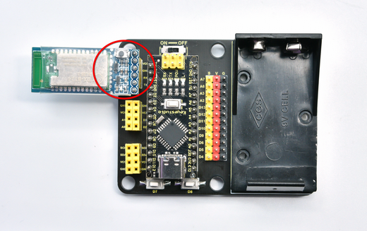

# 2. Product Assembly

Step 1  

As shown below, the kit includes a glove, Nano board, expansion board, MPU6050 module, and BT24 Bluetooth master module (the 9 V battery is **not** included).  

Step 2  

Insert the NANO board into the expansion board according to the pin layout. 

Next, mount the Bluetooth module onto the expansion board as illustrated:  

Step 3  

Pin sequence:  

(GND → GND) (VCC → VCC) (TX → RX) (RX → TX)  

Step 4  

Install the MPU6050 module on the expansion board as shown:  

Step 5  

(GND → GND) (VCC → VCC) (SDA → SDA) (SCL → SCL) 

Step 6  

Peel off the protective film from the double-sided foam tape on the back of the board, stick it to the back of a glove, and press firmly to secure.  

Step 7  

Assembly completed.  

