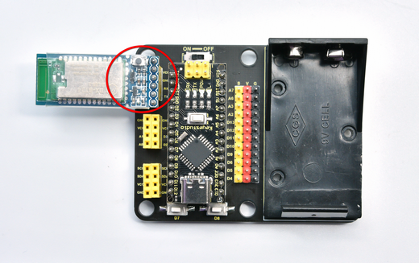
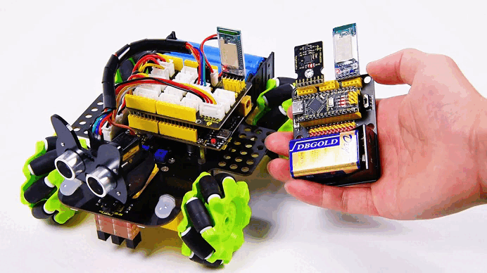
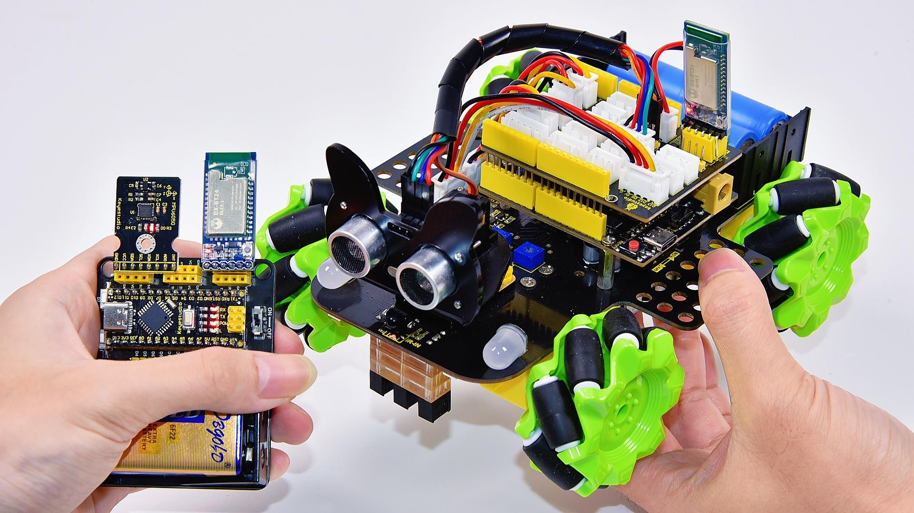
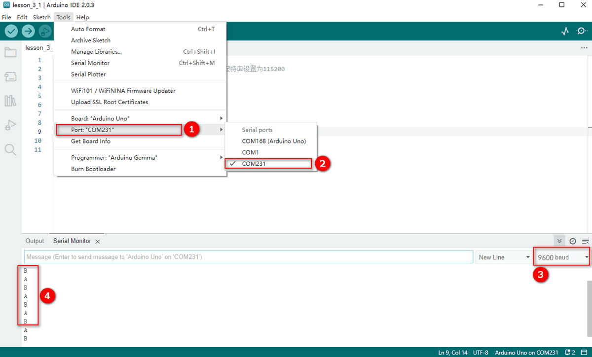

# Project 3: Bluetooth Master — Data Transmission  

### 1 Hardware Overview  

Master Bluetooth module (straight-pin version):  

.png)

The DX-BT24 master Bluetooth module uses the Dialog 14531 chip, complies with the BLE 5.1 protocol, and provides transparent wireless transmission via UART.  
Default serial settings: **9600 bps / 8 data bits / no parity / 1 stop bit**.  

Key features:  
• Flexible baud-rate and name configuration • Ultra-low power: 2 µA • Master/slave LOS range: 20 m / 90 m • Up to 115 200 bps transparent throughput  

---

### 2 Wiring  

| Arduino | BT24 Master |
| :-----: | :---------: |
|   RX    |     TX      |
|   TX    |     RX      |
|  VCC    |    VCC      |
|  GND    |    GND      |

Example hookup:  



---

### 3 BT24 One-Click Master–Slave Pairing (No AT Commands)  

This method requires **no AT commands**—the first pairing and bind information are completed solely with the **on-board buttons**.

#### 3.1 Procedure  

(The gesture-control kit includes a BT24 master module. A BT24 slave module—typically mounted on a smart car—must be purchased separately. The demo below uses the keyestudio mecanum-wheel car.)

1. **Prepare**  
   Both BT24 modules (master and slave) are powered correctly and not connected to other devices.  
   After power-up, both indicator LEDs blink, meaning “not connected”.  


2. **Press Buttons Simultaneously**  
   **Long-press** the buttons on both modules for about 3–5 s until the LEDs on both sides **change from blinking to solid ON**.  
   • Blinking → searching/pairing • Solid ON → paired and connected  


3. **Pairing Complete**  
   Release the buttons. A steady LED indicates that the **transparent link is established** and will auto-reconnect after power loss.  


#### 3.2 Status & Indicator LED  

| LED State | Module Status | Action |
| :-------: | :------------ | :----- |
| Blinking  | Not connected / waiting to pair | No action needed, or long-press again to enter pairing |
| Solid ON  | Connected / transparent link open | Ready to send & receive data |
| Blinking (after short press) | Clear binding | Short-press once to erase pairing info |

To pair with a new device: short-press the buttons on master and slave → LEDs blink → repeat steps 3.1.

---

### 4 Arduino Sending Example  


Insert the **BT24 Bluetooth master module** into the expansion board and upload the following sketch to the **Nano board**:  

```cpp
/* lesson_3_master_send.ino
   Continuously sends characters A and B to the paired slave */
void setup() {
  Serial.begin(9600);       // Must match BT24 master/slave baud rate
}

void loop() {
  Serial.println("A");
  delay(500);
  Serial.println("B");
  delay(500);
}
```

> When uploading code, **remove the BT24 module first** to avoid serial-port conflict.  
> Re-insert the module after programming is finished.

---

### 5 Transmission Verification  

1. Master and slave LEDs are solid ON (connection OK).  
2. Connect the slave to a PC with a second USB-to-Serial adapter and open a serial monitor at 9600 bps.  
3. You should see the strings **“A”** and **“B”** alternating every 0.5 s:  



This confirms that the master’s data is transparently transmitted to the slave.

---

### 6 Common Troubleshooting  

| Symptom | Checklist |
| ------- | --------- |
| No serial output | 1) Master/slave not connected: are LEDs blinking?<br>2) Baud rate mismatch between Arduino Nano and BT24 |
| Garbled text | Monitor baud rate differs from module setting |
| Cannot enter pairing | 1) Were both buttons held simultaneously until LEDs blinked?<br>2) Old binding not cleared—short-press to erase, then retry |

---

You have now completed **data transmission from the BT24 master to the slave** and can extend this approach to more complex wireless communication scenarios.
